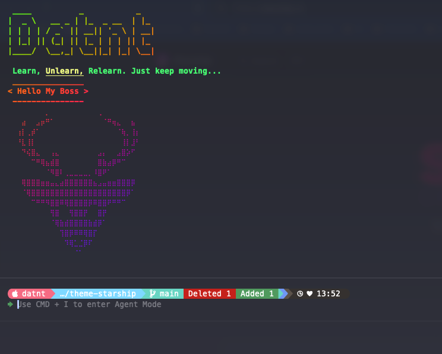

<div align="center">
  <h1>⭐ Starship Terminal Configuration</h1>
  <p>A minimal, blazing-fast, and customizable terminal prompt</p>
  
  

  <div>
    
    <h3>Created by <a href="https://github.com/datnt">@datnt</a></h3>
    <p>Full-stack Developer | UI/UX Enthusiast</p>
  </div>
</div>

## 🚀 Introduction

This is my terminal configuration using [Starship](https://starship.rs) - a minimal, blazing-fast, and infinitely customizable prompt for any shell, written in Rust.

## ✨ Features

- Git repository information display
- Programming language version info (Node.js, Python, Rust, etc.)
- Command execution time
- Customizable colors and icons
- And many more...

## 📦 Installation

1. First, install Starship following the [official guide](https://starship.rs/guide/#🚀-installation)

2. Copy the `starship.toml` configuration file to your config directory:

```bash
# Linux/macOS
cp starship.toml ~/.config/starship.toml

# Windows
cp starship.toml "$env:USERPROFILE\.config\starship.toml"
```

3. Add the initialization script to your shell's configuration file:

```bash
# Bash
eval "$(starship init bash)"

# Zsh
eval "$(starship init zsh)"

# Fish
starship init fish | source
```

## ⚙️ Customization

You can customize the configuration in the `starship.toml` file according to the [official documentation](https://starship.rs/config/).

## 👨‍💻 About the Author

Hi! I'm **Dat Nguyen** (@datnt), a passionate full-stack developer from Vietnam. I love creating beautiful and functional web applications that provide great user experiences.

- 🌐 **Website**: [datnt.dev](https://datnt.dev)
- 📧 **Email**: ntd4996@gmail.com

<div align="center">
  
</div>

## 🤝 Contributing

Contributions are welcome! Feel free to open an issue or submit a pull request if you have any suggestions.

## 📄 License

MIT

<div align="center">
  <h3>Support My Work | Ủng Hộ Tôi</h3>
  
  <a href="https://www.buymeacoffee.com/ntd4996">
    
  </a>
</div>

---

<p align="center">
  <sub>Built with ❤️ by datnt</sub>
</p>
